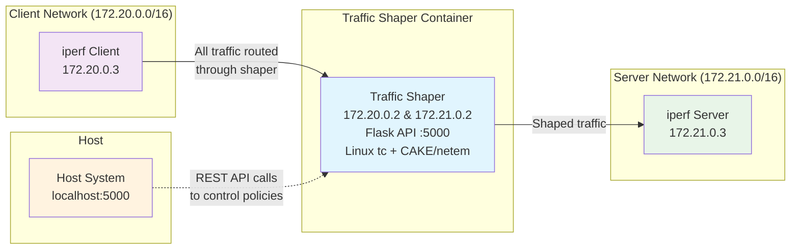

# Traffic Shaping Test Framework

A Docker-based framework for testing network traffic shaping policies using Linux `tc` (Traffic Control) with CAKE qdisc and netem. This system allows you to simulate various network conditions and measure their impact on bandwidth, latency, and packet loss.

## Features

- **Multiple Traffic Shaping Policies**: Pre-configured policies for various network types (Cable, DSL, 4G, 5G, Satellite, etc.)
- **REST API Control**: Flask-based API to dynamically apply and modify traffic shaping policies
- **Automated Testing**: Python test suite that cycles through all policies and generates CSV reports
- **Real-time Metrics**: iperf3 integration for accurate bandwidth, latency, and packet loss measurements
- **Easy to Extend**: JSON-based policy definitions make it simple to add new network profiles

## Architecture

The system consists of three Docker containers:

1. **Traffic Shaper**: Acts as a router with configurable traffic shaping using Linux `tc`
2. **iperf3 Server**: Receives traffic for bandwidth testing
3. **iperf3 Client**: Generates traffic that flows through the shaper to the server



## Directory Structure

```
traffic-shaper-test/
├── docker-compose.yml
├── shaper/
│   ├── Dockerfile
│   ├── shaping-controller.py
│   ├── policies.json
│   └── startup.sh
├── test-automation/
│   ├── test_runner.py
│   └── requirements.txt
├── quick_test.sh
└── README.md
```

## Prerequisites

- **Native Linux system** (Ubuntu 22.04 or similar) with full kernel access
  - ⚠️ **Note:** This framework requires Linux Traffic Control kernel modules (`sch_netem`, `sch_cake`, etc.)
  - Not compatible with WSL, ChromeOS containers, or Docker Desktop on macOS/Windows
  - Works best on: bare metal Linux, Linux VMs with kernel access, or cloud Linux instances
- Docker and Docker Compose
- Python 3.8+
- jq (for quick_test.sh)

```bash
# Install dependencies
sudo apt-get update
sudo apt-get install -y docker.io docker-compose python3-pip jq
sudo usermod -aG docker $USER
# Log out and back in for group changes to take effect
```

### Verifying Kernel Module Support

Before running, verify your system has the required traffic control modules:

```bash
# Check for netem support
sudo modprobe sch_netem
lsmod | grep sch_netem

# Check for CAKE support (requires kernel 4.19+)
sudo modprobe sch_cake 2>/dev/null
lsmod | grep sch_cake
```

If these commands succeed without errors, your system supports traffic shaping.

## Quick Start

### 1. Clone and Setup

```bash
# Clone the repository
git clone <your-repo-url>
cd traffic-shaper-test

# Install Python dependencies
cd test-automation
pip3 install -r requirements.txt
cd ..
```

### 2. Start the System

```bash
# Build and start all containers
docker-compose up --build -d

# Wait for containers to be healthy
sleep 15

# Verify containers are running
docker-compose ps
```

### 3. Test Manually

```bash
# Check API health
curl http://localhost:5000/health

# List available policies
curl http://localhost:5000/policies | jq

# Apply a policy
curl -X POST http://localhost:5000/policy/apply \
  -H "Content-Type: application/json" \
  -d '{"policy": "mobile_4g"}'

# Run iperf test
docker exec iperf_client iperf3 -c 172.21.0.3 -t 30

# Clear shaping
curl -X POST http://localhost:5000/policy/clear
```

### 4. Run Automated Tests

```bash
# Run the full test suite (tests all policies)
cd test-automation
python3 test_runner.py

# Results will be saved to test_results.csv
cat test_results.csv
```

### 5. Quick Single Policy Test

```bash
# Make the script executable
chmod +x quick_test.sh

# Test a specific policy
./quick_test.sh residential_cable

# Or use default (mobile_4g)
./quick_test.sh
```

## Remote Deployment with SSH Tunnel

For security, the API is configured to bind only to localhost. When deploying to a remote server, use an SSH tunnel to securely access the API.

### Deploy to Remote Server (e.g., DigitalOcean)

```bash
# SSH into your remote server
ssh root@your-server-ip

# Clone and start the framework
git clone https://github.com/yourusername/traffic_shaper.git
cd traffic_shaper
docker-compose up --build -d
```

### Create SSH Tunnel for Secure Access

From your local machine, create an SSH tunnel to access the remote API:

```bash
# Create tunnel (runs in background)
ssh -f -N -L 5000:localhost:5000 root@your-server-ip

# Now access the API as if it were local
curl http://localhost:5000/health
curl http://localhost:5000/policies | jq


## Notes about Raspberry Pi / Bookworm support

This repository has been updated to improve compatibility with Raspberry Pi running Debian Bookworm (64-bit):

- `shaper/Dockerfile` now uses `debian:bookworm-slim` and installs only required packages (ARM-friendly).
- An `iperf` service Dockerfile was added at `iperf/Dockerfile` so the iperf3 server image is built from `debian:bookworm-slim` and is cacheable.
- A GitHub Actions workflow was added at `.github/workflows/build-and-push.yml` to optionally build multi-arch images (linux/amd64 and linux/arm64). To use it, set `DOCKERHUB_USERNAME` and `DOCKERHUB_TOKEN` secrets and update tags as desired.

To run locally on a Raspberry Pi (Bookworm, 64-bit):

```bash
cd /home/linux/code/traffic_shaper
# Apply policies remotely
```

If your Pi is 32-bit (armhf/armv7), change `platform: linux/arm64` entries in `docker-compose.yml` to the appropriate `linux/arm/v7` or remove `platform` and build the images directly on the Pi.
curl -X POST http://localhost:5000/policy/apply \
  -H "Content-Type: application/json" \
  -d '{"policy": "mobile_4g"}'
```

### Managing the SSH Tunnel

```bash
# Check if tunnel is running
ps aux | grep "ssh.*5000:localhost:5000"

# Close the tunnel
pkill -f "ssh.*5000:localhost:5000"

# Or use SSH control sockets for easier management
ssh -f -N -M -S /tmp/traffic-shaper-tunnel \
  -L 5000:localhost:5000 root@your-server-ip

# Close tunnel via control socket
ssh -S /tmp/traffic-shaper-tunnel -O exit root@your-server-ip
```

### Running Tests on Remote Server

```bash
# Via SSH (direct connection)
ssh root@your-server-ip "cd /root/traffic_shaper && ./quick_test.sh satellite"

# Via tunnel (from local machine)
# First: create tunnel as shown above
# Then: use local commands
curl -X POST http://localhost:5000/policy/apply \
  -H "Content-Type: application/json" \
  -d '{"policy": "satellite"}'
```

## API Endpoints

### GET /health
Health check endpoint
```bash
curl http://localhost:5000/health
```

### GET /policies
List all available policies
```bash
curl http://localhost:5000/policies | jq
```

### POST /policy/apply
Apply a traffic shaping policy
```bash
curl -X POST http://localhost:5000/policy/apply \
  -H "Content-Type: application/json" \
  -d '{"policy": "mobile_4g"}'
```

### POST /policy/clear
Clear all traffic shaping
```bash
curl -X POST http://localhost:5000/policy/clear
```

### GET /policy/current
Get currently applied policy
```bash
curl http://localhost:5000/policy/current | jq
```

### GET /stats
Get traffic statistics
```bash
curl http://localhost:5000/stats | jq
```

## Available Policies

| Policy | Type | Bandwidth | Latency | Loss | Description |
|--------|------|-----------|---------|------|-------------|
| no_shaping | none | unlimited | ~0ms | 0% | Baseline (no shaping) |
| fiber_1gig | CAKE | 1 Gbps | 5ms | 0% | Gigabit fiber |
| residential_cable | CAKE | 100 Mbps | 20ms | 0% | Typical cable modem |
| residential_dsl | CAKE | 25 Mbps | 40ms | 0% | DSL connection |
| mobile_5g | netem | 200 Mbps | 30ms ±10ms | 0.5% | 5G mobile |
| mobile_4g | netem | 50 Mbps | 50ms ±20ms | 1